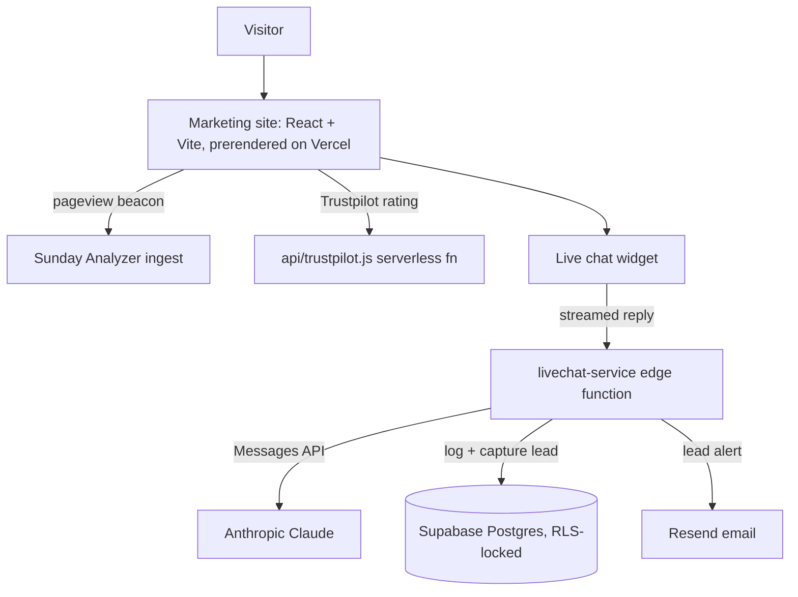

<p align="center">
  
</p>

<h1 align="center">TaylorURL</h1>

<p align="center">
  <b>Custom websites and JavaScript applications for local businesses.</b>
</p>
<p align="center">
  The studio site for TaylorURL LLC — a prerendered React marketing site with a<br />
  Claude-powered live chat that captures leads. Live at <a href="https://taylorurl.com">taylorurl.com</a>.
</p>

<p align="center">
  
  
  
  
  
  
  
</p>

<br />

## Why TaylorURL

Most small-business sites are either a static template that never ranks or a single-page app that hands crawlers an empty shell. TaylorURL is the studio's own site built to do the opposite: every route is rendered to real static HTML at build time with per-page meta and JSON-LD, an AI assistant answers project questions and files qualified leads mid-conversation, and analytics are first-party and cookieless — no third-party trackers, no cookie banner.

<table width="100%">
  <tr>
    <td width="33%" valign="top">
      <h3 align="center">Built to rank</h3>
      <p align="center">Every route is prerendered to static HTML at build time with per-page meta and JSON-LD, so crawlers get real SEO markup instead of an empty SPA shell.</p>
    </td>
    <td width="33%" valign="top">
      <h3 align="center">AI live-chat</h3>
      <p align="center">A floating assistant streams Anthropic's Claude from a Supabase edge function and files qualified leads mid-conversation through a <code>capture_lead</code> tool.</p>
    </td>
    <td width="33%" valign="top">
      <h3 align="center">Cookieless analytics</h3>
      <p align="center">Pageviews beacon to a self-hosted Sunday Analyzer ingest function — first-party, no third-party trackers, and no cookie banner.</p>
    </td>
  </tr>
</table>

<br />

## Stack

| Layer | Technology |
| :--- | :--- |
| UI | React 19 + React Router 7 |
| Build & dev | Vite 7 with custom prerender + sitemap plugins |
| Styling | Tailwind CSS 3 + `tailwindcss-animate` |
| Animation | Framer Motion 12 |
| Icons | `lucide-react` |
| Backend | Supabase (Postgres + Edge Functions) |
| Chat AI | Anthropic Claude — streamed Messages API |
| Analytics | Sunday Analyzer (first-party, cookieless) |
| SEO | `react-helmet-async` + build-time static prerender |
| Serverless & hosting | Vercel Functions + Vercel |

## Getting started

```bash
npm install
npm run dev           # Vite dev server
npm run build         # production build, then static prerender of every route
```

Copy `.env.example` to `.env.local` and set `VITE_SUPABASE_URL` and `VITE_SUPABASE_ANON_KEY` — the live-chat widget, newsletter, and email capture call Supabase. The app renders without them, but those features stay inert.

### Scripts

| Script | Does |
| :--- | :--- |
| `npm run dev` | Start the Vite dev server. |
| `npm run build` | Production build, then static prerender of every route. |
| `npm run lint` | Lint with ESLint. |
| `npm run lint:fix` | Lint and auto-fix. |
| `npm run format` | Format `src/**` with Prettier. |
| `npm run format:check` | Check formatting without writing. |

## Architecture



## How it works

- **Prerendered for SEO.** The site is a React SPA that also renders every route to static HTML at build time. `vite/prerender-plugin.js` loads `src/entry-server.jsx` through Vite's SSR loader — no headless browser — and writes a real document per route, directory-style URLs plus a top-level `404.html`.
- **Real markup in the head.** React 19 hoists each page's `react-helmet-async` title, meta, canonical, Open Graph, and JSON-LD into the prerendered `<head>`, and `vite/sitemap-plugin.js` emits `sitemap.xml` from the same route table.
- **Targeted at local search.** Pages carry `geo.*` meta and a `LocalBusiness` / `ProfessionalService` schema for Baytown, TX and the greater Houston area.
- **A live-chat that captures leads.** `ChatWidget` (mounted site-wide in `Layout`) streams replies token by token from the `livechat-service` Supabase edge function, which calls Anthropic's Messages API and exposes a `capture_lead` tool so the model can file a lead without leaving the chat.
- **Secrets stay on the server.** Conversations, messages, and leads are written to Postgres tables whose RLS is locked to the service role — the browser's anon key can neither read nor write them. Lead notifications go out via Resend, and the Anthropic, service-role, and Resend keys never leave the server.

## Project structure

```
taylorurl-com/
├── api/                       Vercel serverless functions (Trustpilot rating fetch)
├── onboarding/                Standalone HTML client-onboarding guides
├── public/                    Static assets — logo, portfolio shots, robots.txt
├── supabase/
│   ├── functions/             Edge functions (livechat-service: Claude + lead capture)
│   └── migrations/            SQL — chat conversations / messages / leads
├── vite/                      Build plugins (prerender, sitemap) + shared route table
├── src/
│   ├── app/
│   │   ├── components/        Layout, Navigation, ChatWidget, mockups, Seo
│   │   ├── views/             Route views (Home, Services, Portfolio, Blog, Status…)
│   │   ├── hooks/             auth, toast, blog filters, scroll/parallax
│   │   ├── constants/         navigation, seo, animations, ui
│   │   ├── data/              blog articles, portfolio, home copy, supabaseClient
│   │   └── utils/             blog-HTML sanitization (DOMPurify), validation
│   ├── lib/sunday-analyzer/   First-party cookieless pageview analytics
│   ├── entry-server.jsx       Prerender entry (react-dom/server)
│   └── main.jsx               Browser entry
└── vercel.json                Security headers + caching
```

## License

Copyright (c) 2026 Trenton Taylor. All rights reserved. See [LICENSE.md](LICENSE.md).

<br />

<p align="center">
  <sub>Custom sites for local businesses — built to rank, wired to convert.</sub>
</p>
