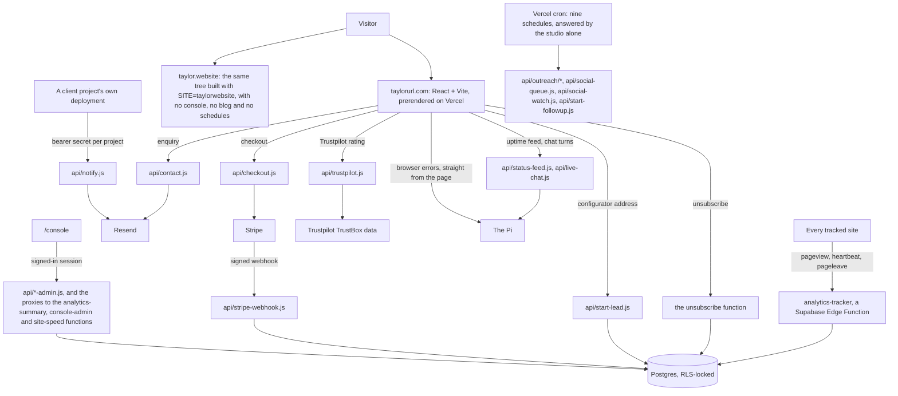

<p align="center">
  
</p>

<h1 align="center">TaylorURL</h1>

<p align="center">
  <b>Custom websites and JavaScript applications for local businesses.</b>
</p>
<p align="center">
  The sites of TaylorURL LLC — one prerendered React tree that builds two deployments.<br />
  Live at <a href="https://www.taylorurl.com">taylorurl.com</a>, the studio, and <a href="https://taylor.website">taylor.website</a>, the subsidiary.
</p>
<p align="center">
  <sub>Published for reading. Proprietary — see <a href="LICENSE.md">LICENSE.md</a>. Outside contributions are not accepted.</sub>
</p>

<p align="center">
  
  
  
  
  
  
</p>

<br />

## Why TaylorURL

Most small-business sites are either a static template that never ranks or a single-page app that hands crawlers an empty shell. These are the studio's own sites, built to do the opposite: every route is rendered to real static HTML at build time with per-page meta and JSON-LD, and the analytics are first-party and cookieless. The only third-party scripts on a page are the Google and Meta tags behind the studio's own ad campaigns, fetched after the reader's first touch rather than with the page, and there is no cookie banner: the privacy page says what they do, honours Global Privacy Control as an opt-out, and puts nothing behind a cookie wall.

<table width="100%">
  <tr>
    <td width="50%" valign="top">
      <h3 align="center">Built to rank</h3>
      <p align="center">Every route is prerendered to static HTML at build time with per-page meta and JSON-LD, so crawlers get real SEO markup instead of an empty SPA shell.</p>
    </td>
    <td width="50%" valign="top">
      <h3 align="center">Cookieless analytics</h3>
      <p align="center">Pageviews go to the studio's own collector with no cookie and no address. The ad tags are the only third-party scripts, they wait for the reader's first touch, and there is no cookie banner.</p>
    </td>
  </tr>
</table>

<br />

## Stack

| Layer                | Technology                                                                                                                                                                         |
| :------------------- | :--------------------------------------------------------------------------------------------------------------------------------------------------------------------------------- |
| UI                   | React 19 + React Router 7                                                                                                                                                          |
| Build & dev          | Vite 7 with the plugins under `vite/`: the prerender with each page's critical CSS inlined, sitemap, feed, llms.txt, the review schema, and the per-site head and static files     |
| Styling              | Tailwind CSS 3, on the token block in `src/index.css`                                                                                                                              |
| Animation            | Framer Motion 12                                                                                                                                                                   |
| Charts               | `recharts` — the console's traffic, vitals and mail charts                                                                                                                         |
| Icons                | `lucide-react`                                                                                                                                                                     |
| WebGL effects        | `ogl` — particles, aurora backdrop                                                                                                                                                 |
| Backend              | Supabase Postgres, and its Edge Functions for the analytics collector and summary, email capture and the subscription links, the admin console's writes and the PageSpeed readings |
| Auth                 | Supabase Auth — accounts, with a role per profile                                                                                                                                  |
| Analytics            | First-party, cookieless, one collector for every site under care                                                                                                                   |
| Ad measurement       | The Google tag (GA4 and Ads conversions) and the Meta pixel, identified per site in `lib/site/registry.js`, fetched only after the reader's first touch or ten settled seconds     |
| Outbound mail        | Resend for enquiries, the configurator's follow-up and client notifications; Nodemailer and IMAP for outreach                                                                      |
| SEO                  | `react-helmet-async` + build-time static prerender                                                                                                                                 |
| The Pi               | The studio's own machine, behind `api/`: the uptime feed, the chat assistant and the brief's writing help, and the browser error reporter the page posts to directly               |
| Serverless & hosting | Vercel Functions, on two Vercel projects built from this one tree and keyed by `SITE`                                                                                              |

## Getting started

```bash
npm install
npm run dev           # Vite dev server
npm run build         # production build, static prerender of every route, then the two postbuild checks
```

Node 22, which is what `engines` names and what CI and the capture workflow run on. No environment configuration is required to run the site locally: the forms and the console's sign-in reach the backend with a publishable key, which row-level security scopes to what an anonymous reader may already see. The variables the functions under `api/` read are named in `.env.example` and set per environment in Vercel; the file carries none of their values.

One tree builds two deployments. `SITE` picks the record in `lib/site/registry.js` the build is for — unset or `taylorurl` is the studio, `SITE=taylorwebsite npm run build` is the subsidiary — and `lib/site/current.js` is the one file that reads it. Vite substitutes the key as a literal in the browser bundle, so the record that lost is dropped from it, while the same expression stays a real environment read inside a function and in the prerender. CI builds both.

`npm run build -- --no-prerender` stops at the bundle, for the rare run that only wants to see what the bundler produced. The git hooks under `.githooks/` are pointed at by `.claude/hooks/session-start.sh` at the start of an agent session; on any other clone it is one line:

```bash
git config core.hooksPath .githooks
```

`lib/` is part of the browser build, not only the serverless runtime. The console's outreach section reads a prospect the same way the pipeline writes one, so `src/app/utils/outreachOpportunity.js` imports `lib/outreach/prospects/platforms.js` and the build fails there if that directory is missing. Anything that carves the tree up — a partial checkout, a deploy that ships only `src/`, a branch holding the console without the pipeline — has to carry `lib/` with it.

### Scripts

| Script                           | Does                                                                                                                                                    |
| :------------------------------- | :------------------------------------------------------------------------------------------------------------------------------------------------------ |
| `npm run dev`                    | Start the Vite dev server.                                                                                                                              |
| `npm run build`                  | Production build and static prerender of every route, then `postbuild` runs the internal-link check over what was written.                              |
| `npm test`                       | Run the check suite: the scripts under `scripts/`, in the order `package.json` lists them.                                                              |
| `npm run check:<name>`           | One check on its own. Most of the suite has a script of its own named after the file: `check:notify`, `check:site-key`, `check:traffic-ignore`…         |
| `npm run capture:portfolio`      | Regenerate the portfolio preview images in `public/portfolio/`.                                                                                         |
| `npm run audit:portfolio`        | Read every live site the portfolio names and report where the recorded copy no longer matches it.                                                       |
| `npm run capture:review-logos`   | Regenerate the reviewer logos in `public/images/reviews/` from each client's own site.                                                                  |
| `npm run capture:status-board`   | Retake the status board shots the home page shows, into `public/home/`.                                                                                 |
| `npm run capture:process-shots`  | Retake the process step shots the home page shows, into `public/home/`.                                                                                 |
| `npm run refresh:trustpilot`     | Rewrite the committed Trustpilot standing in `src/app/data/reputation/` from the live profile; the business node and the badge's fallback both read it. |
| `npm run refresh:db-constraints` | Take the schema's CHECK constraints again into `scripts/db/db-constraints.json`. Run it with every migration.                                           |
| `npm run social:<verb>`          | Drive the client post queue by hand through `scripts/social/social.js`: `status`, `watch`, `promote`, `cards`, `announce`.                              |
| `npm run lint`                   | Lint with ESLint.                                                                                                                                       |
| `npm run lint:fix`               | Lint and auto-fix.                                                                                                                                      |
| `npm run format`                 | Format the repo with Prettier.                                                                                                                          |
| `npm run format:check`           | Check formatting without writing.                                                                                                                       |

## Architecture


```mermaid
flowchart TD
    V["Visitor"] --> Site["taylorurl.com: React + Vite, prerendered on Vercel"]
    V --> Sub["taylor.website: the same tree built with SITE=taylorwebsite, with no console, no blog and no schedules"]
    Any["Every tracked site"] -->|"pageview, heartbeat, pageleave"| IN["analytics-tracker, a Supabase Edge Function"]
    IN --> DB[("Postgres, RLS-locked")]
    Site -->|"unsubscribe"| EF["the unsubscribe function"] --> DB
    Site -->|"enquiry"| CT["api/contact.js"] --> RS["Resend"]
    Site -->|"configurator address"| SL["api/start-lead.js"] --> DB
    Site -->|"checkout"| CK["api/checkout.js"] --> ST["Stripe"] -->|"signed webhook"| WH["api/stripe-webhook.js"] --> DB
    Site -->|"Trustpilot rating"| TP["api/trustpilot.js"] --> TB["Trustpilot TrustBox data"]
    Site -->|"uptime feed, chat turns"| PX["api/status-feed.js, api/live-chat.js"] --> PI["The Pi"]
    Site -->|"browser errors, straight from the page"| PI
    Console["/console"] -->|"signed-in session"| ADM["api/*-admin.js, and the proxies to the analytics-summary, console-admin and site-speed functions"] --> DB
    Client["A client project's own deployment"] -->|"bearer secret per project"| NF["api/notify.js"] --> RS
    Cron["Vercel cron: nine schedules, answered by the studio alone"] --> Jobs["api/outreach/*, api/social-queue.js, api/social-watch.js, api/start-followup.js"]
```

## How it works

- **Prerendered for SEO.** The site is a React SPA that also renders every route to static HTML at build time. `vite/prerender-plugin.js` loads `src/entry-server.jsx` through Vite's SSR loader — no headless browser — and writes a real document per route, directory-style URLs plus a top-level `404.html`. Each page carries the rules its own markup needs inline, worked out by Beasties, and asks for the sheet itself on a media query that matches nothing until it lands, so the first paint waits on no stylesheet.
- **Two sites from one tree.** `lib/site/registry.js` holds one record per deployment — origin, brand, the contact scalars, the head copy, the analytics key and the ad identifiers, and the flags that say whether the site has a blog, reviews, a local business node, a console, and answers the schedules — and `lib/site/current.js` resolves `SITE` to one of them. `index.html` is a template: `%SITE_X%` tokens are filled from the record and `<!--site:flag-->` fences are kept or cut by it, so the subsidiary publishes no business node, no reviews and no feed link. Its pages are a written list in `lib/site/routes/taylorwebsite.js` rather than a filter over the studio's, `apiAllowlist` names the endpoints it answers on — the enquiry form and the build stamp, and nothing else — and `vite/site-static-plugin.js` corrects what `public/` delivered for the site being built. `scripts/site/check-site-key.js` holds the two records to the same shape and exactly one of them to the schedules.
- **Real markup in the head.** React 19 hoists each page's `react-helmet-async` title, meta, canonical, Open Graph, and JSON-LD into the prerendered `<head>`, and `vite/sitemap-plugin.js`, `vite/feed-plugin.js` and `vite/llms-plugin.js` emit `sitemap.xml`, `feed.xml` and `llms.txt` from the same route table.
- **Targeted at local search.** Pages carry `geo.*` meta and a `LocalBusiness` / `ProfessionalService` schema for Baytown, TX and the greater Houston area. The work is carried out from Baytown and there is nowhere a visitor can be met, so the schema's address stops at the locality and `areaServed` carries the reach as a circle plus the markets the service pages name. The foot of the studio's pages prints the company's Houston mail box, which is the address the business is written to rather than a place it can be visited, so it stands in the colophon and stays out of the schema.
- **The console asks for a sign-in.** `/console/status` is the uptime monitor's board and is open to anyone; it reports on no account. Every other section verifies the session against the project, and the database functions decide what that account may read, so the page chooses what to show and never what it is allowed to fetch.
- **What the sender cannot reach is a phone list rather than a dead end.** The cold email pipeline ends at an address, and about a fifth of what the map sweep finds has none to end at: the listing names no website, or names a Facebook page, a Linktree or a Square booking page whose only published address belongs to the platform. Those rows stop at `unreachable`, and they are the strongest leads on the table, because the thing being sold is the thing they visibly do not have. `/console/calls` is where they are dialled. The order is not the review count, which is not comparable across trades - a restaurant collects reviews from every table it turns and a machine shop collects them from the two customers a year who think to leave one - so a business is ranked on its count against the middle count for its own trade, behind any callback that has come due. `outreach_calls` holds one row per attempt rather than a state on the prospect, so a number rung twice reads as twice.

- **One tracker, every site.** The collector serves the browser tracker that every site TaylorURL runs includes with a single script tag, so a change to what gets collected is one deploy rather than a dozen releases. Hits carry no address and no cookie: the country comes from the browser's own timezone, the session and visitor ids are random numbers in the browser's storage, and the collector accepts a hit only from the origins its site is registered with.
- **Type is served from this origin.** Geist and Geist Mono are two variable woff2 files in `public/fonts/`, declared as `@font-face` in `src/index.css` and preloaded from `index.html`, so the first paint waits on nothing third-party.
- **Secrets stay on the server.** The configurator's leads, the enquiry attribution and the notify tables all have row-level security on with no policies at all, so only the service role reaches them — the browser's publishable key can neither read nor write them. The browser never writes to them directly either: a lead goes through `api/start-lead.js`, which measures what it was sent before a row is written.
- **Client projects send through this one.** Every product the studio runs eventually has to reach somebody with the site closed, and a sender per client would be a domain to warm and a reputation to earn per client. `api/notify.js` lends them this one: a project posts what happened with its own bearer secret, and the message is drawn on the same sheet in that project's name, colour and mark. The identity is a row rather than a branch — a project becomes able to send when one appears in `notify_projects` — and the row is found by the digest of the secret presented, so a deployment can only ever send as itself.

## The lead figure

Three surfaces take an enquiry, and all three post to `api/contact.js`: the contact page, the free tools, and the configurator. Each names itself in `form`, so `public.enquiry_attribution` answers which of the three produced a lead and which campaign it arrived on. That table is the lead figure. Nothing else on the site counts as one — a checkout that opens is a sale in Stripe, and the address the configurator and the payment page record in `start_leads` on their first screen is a lead to follow up rather than an enquiry. That row is what `/console/leads` lists and what `api/start-followup.js` writes to an hour later, and it reaches this table only when the person writes in.

The configurator is the newest of the three and the reason the number moved. It asks five screens of questions and used to end at a card, so a visitor who answered four of them and stopped left nothing behind at all; `SaveSection` sends the configuration as it stands, and the pay step's second button carries the same answers to the contact form rather than dropping them.

**The table starts on the evening of 29 August 2026**, read in Central like every other time in this project; its first row is stamped 30 August in UTC. Enquiries before that were delivered and never filed, so there is no earlier figure to compare against and one cannot be reconstructed from anything the site holds — the record of them is the inbox. Read the number from that date forward and treat anything before it as unmeasured rather than as zero:

```sql
select date_trunc('week', created_at) as week, form, count(*)
from enquiry_attribution group by 1, 2 order by 1 desc;
```

Two things in `analytics_events` are not visitors, and a rate taken against the raw table rather than through the console will count both. Hits the collector marks `device_type = 'bot'` are one, and the console never sees them: `analytics_overview` and `analytics_site`, the two functions behind every figure it draws, already drop them. Hand-written SQL against the table does not, which is the only place that difference shows up.

The console itself is the other. It is the studio's own workspace, open all day, and it stood for over a third of everything recorded. The tracker now files nothing for it — no view, no dwell, no heartbeat, so it does not appear in the live view either. The rule is declared on the script tag in `index.html` rather than held in the collector, because one tracker serves every site TaylorURL runs and a private workspace on this one is an ordinary page on the next:

```html
data-ignore="/console,/login,!/console/status"
```

A path is ignored when it sits under an entry, unless it sits under one marked `!`, which counts it — the status board is open to anyone and the home page sends readers to it by name. A site that declares nothing ignores nothing.

The tag only governs what is collected from the deploy forward, and a 30-day window reaches back well before it. So the console reads the same rule a second time over the rows it draws: `src/app/views/analytics/lib/counted.js` takes those paths out of the pages table and the two rankings beside it, and `scripts/console/check-traffic-ignore.js` holds the two declarations to the same string. It applies to this site's rows and no others — one tracker serves every site under care, and `rootriseholdings.com/login` is a client's own sign-in page rather than a workspace. What it does not touch is the window's totals, which arrive already added up, so a pageview count taken before the deploy still carries the console inside it. The rows the collector sends are the fifty most read, and dropping some of them leaves fewer rather than reaching for the next few; both heal as the window rolls past 5 September 2026.

## Blog

Articles are data, not pages. Each one is an object in `src/app/data/blog/` carrying its title, category, date and body blocks, and everything downstream is derived from that list: the cards, the article route, the sitemap entry, the feed entry, the prerendered HTML, and the JSON-LD. Publishing is appending an object and one line naming its series.

Two axes cross over the same articles. A **category** — one of five — says what an article is about and drives the filter row. A **series** — one of six, defined in `src/app/data/blog/series.js` — says which running body of work it belongs to, gets its own page at `/blog/series/<slug>`, and is what a reader follows from one article to the next three. An article belongs to exactly one series; a series with nothing in it yet is defined in the register but appears nowhere on the site. Every article page carries a share row and the accounts the business posts from, both plain links, so no network's script loads on a reader who only scrolled past. The subsidiary publishes none of this: its record says it has no blog, its route list names no article, and its head carries no feed link.

## Notifications for client projects

`api/notify.js` is the one door a client project's own deployment knocks on to reach a person. It posts what happened; the studio's mail stack delivers it as an email drawn in that project's name, colour and mark. Nothing in the endpoint knows what any one client is: a project becomes able to send when a row appears in `notify_projects`, and stops when that row's `active` goes false.

### How a project authenticates

A project holds one secret and names itself on every call.

```
Authorization: Bearer <the project's own secret>
X-Notify-Project: <slug>
```

The row is found by the SHA-256 of the secret presented, never by the slug, so there is no field a caller controls that names a project its credential does not resolve to. `X-Notify-Project` is then read against the row that came back, which is what tells a deployment holding the wrong secret on its first call rather than on the day somebody notices the wrong logo. A missing token, an unknown one, and a real one naming somebody else's project are refused in the same sentence, because three different ones would let anybody with an HTTP client learn which projects exist. `CRON_SECRET` is the one token on which the header selects a project instead of confirming one.

The secret in plain text exists only on the client's own deployment. This side holds its digest, so a service-role read of the table — which the mail console performs — hands out nobody's sending credential.

### The request

`POST https://www.taylorurl.com/api/notify`, `Content-Type: application/json`, at most 16 KB.

| Field             | Shape                                          | What it does                                                    |
| :---------------- | :--------------------------------------------- | :-------------------------------------------------------------- |
| `subject`         | string, required, cut to 140                   | The subject line, and the heading inside the message            |
| `severity`        | `info`, `warning` or `urgent`, default `info`  | Who is reached, and whether the message is marked urgent        |
| `lines`           | up to 16 `[label, value]` pairs                | The facts, set in two columns                                   |
| `body`            | string up to 4000, newlines kept               | What the notification carries in its own words                  |
| `link`            | `{ label, url }`, `https:` only                | The one thing the reader is asked to open                       |
| `idempotency_key` | `[A-Za-z0-9:_.-]{1,200}`, default a random one | What makes a retry of a post whose answer was lost send nothing |

At least one of `lines` or `body` has to be there. Unknown fields are ignored, so a caller can start sending a field before this endpoint has learned it. A value longer than its cap is cut rather than refused; the request itself is refused, because a body this endpoint has to parse before it can measure is worth a ceiling.

`GET` on the same URL, with the same two headers, answers the project's own record — its name, sending address, accent, how many seats it has, and what the day's ceiling has counted — and mails nobody. It is how a deployment proves its credential without waking anyone, and it carries counts rather than addresses.

### The answers

| Status | Body                                                                  | What the caller does                                                                        |
| :----- | :-------------------------------------------------------------------- | :------------------------------------------------------------------------------------------ |
| `200`  | `{ id, project, severity, recipients, delivered, failed, duplicate }` | Reached `delivered` of `recipients`. Anything under is worth a log line                     |
| `200`  | the same, plus `reason`, with `delivered: 0`                          | Nobody takes a notification at that level. Log it as a failure, and post the same key again |
| `200`  | `{ id, project, delivered: 0, duplicate: true }`                      | This key has reached somebody already. Nothing to do                                        |
| `400`  | `{ error }`                                                           | The body is wrong. Fix the caller; retrying will not help                                   |
| `401`  | `{ error: "not authorized" }`                                         | The credential or the slug is wrong                                                         |
| `403`  | `{ error }`                                                           | The project is not sending right now                                                        |
| `413`  | `{ error }`                                                           | Over 16 KB                                                                                  |
| `429`  | `{ error }`, with `Retry-After`                                       | Wait the seconds named and post the same key again                                          |
| `502`  | `{ error }`                                                           | Nothing was delivered. Post the same key again                                              |
| `503`  | `{ error }`                                                           | The deployment is not set up to send. Post the same key again later                         |

A notification is claimed in `notify_deliveries` before anything reaches the transport, so the same `idempotency_key` posted twice reaches somebody once — which matters because the callers are schedules, and a sweep that cannot tell whether its notification landed will post it again. A claim that failed is owed and is picked up by the next post of that key; so is one a run died holding.

Only a delivery stamps a row sent, and that is what makes `duplicate: true` safe to read as _delivered_ rather than merely as _claimed_. A send that reached nobody is stamped failed, exactly like one the provider refused, so its key stays retakeable and every later post of it is answered with the same `reason` rather than with a `duplicate` the caller would record as told.

The one answer worth reading carefully is a `200` carrying a `reason`. A project whose whole list is paused, suppressed or standing above the severity reached nobody and did not fail, and a caller that treats it as a success is back to the alert that never arrived and never errored. It is worth posting again on the next pass: the recipient list is read fresh every time, so the seat being added, un-paused, lowered to this severity or lifted off the suppression list is what turns the next post into a delivery.

### How a project is branded

Everything a reader sees comes off the project's own row. `name` and `mark_url` draw the masthead, with `mark_ground` saying whether the artwork survives the black slab or needs the pale one; `accent` colours the eyebrow rule and the button; `site_url` is set beside the mark as the domain the message is about; `link_label` is what an unlabelled link is called; `footer_line` signs it off. `from_name` and `from_address` are the sending identity, and `reply_to` is where an answer written from the message goes.

The address has to be on a domain Resend has verified against the studio's account, which is `notifications@taylorurl.com` until a client verifies their own. Moving a project to its own address afterwards is one column changing and nothing else.

There is no template per project. A notification is a heading, a short reading of facts and one thing to open, and a project that needs its own layout needs its own product rather than a branch in this one.

### Adding the next project

1. Mint the secret — `openssl rand -hex 32` — and store it in the vault. It is never written into `notify_projects`.
2. Insert the project row with `secret_sha256` set to the SHA-256 hex of that secret, and its name, accent, mark and footer. Set `link_label` too: an unlabelled link falls back to the project's own name, so the button on every message reads as the client's brand rather than as what pressing it does.
3. Set `burst_limit` against the caller's cadence rather than taking the default. The window is ten minutes wide, so a project posting from a cron works out at (posts per pass) × (passes per ten minutes), and the ceiling wants headroom above that — a caller sending up to four an invocation on a two-minute schedule reaches twenty, and a limit under it refuses real traffic on the first busy morning.
4. Insert a row in `notify_recipients` per person, each with the quietest severity they want to be woken for. The suppression list is checked over the top of that, so an address that has unsubscribed or hard bounced is reached by nothing. Seed this before the secret reaches the client's deployment: a project with no seats yet answers every post with a reason and reaches nobody, which is honest but is not a notification.
5. Put the secret on the client's deployment and have it post as above.
6. Optionally verify the client's domain in Resend and move `from_address` onto it.

The row is the whole of it. Nothing about a new project is a release on this side.

## Project structure

```
taylorurl-com/
├── api/                       Vercel serverless functions, one URL each — the enquiry form, the configurator's lead record and its follow-up, checkout, the hand-quoted checkout link and the Stripe webhook, a client's projects, brief and writing help, account deletion, the live chat, the Trustpilot and status proxies, the analytics, console-admin and PageSpeed proxies, the admin reads and writes behind each console section, the notifications door client projects send their own alerts through, the outreach and social pipelines on their schedules, the public speed check and site audit, and the build stamp
├── brand/                     The post cards the queue publishes, the subsidiary's share card, and the faces they draw with
├── lib/                       Shared by the functions under api/ and by the console bundle
│   ├── db/                    Paged reads, the two Supabase clients and the door in front of them, and the shapes a value takes before it reaches a column
│   ├── enquiry/               What each enquiry form asks, in the words the sender read
│   ├── http/                  Request guards, the per-caller window, the timed fetch, the scheduler check, the public-address check, and the console's edge proxy
│   ├── leads/                 The address the configurator records, the two pages that record one, and the one message a lead who did not finish gets
│   ├── live-chat/             How much of the assistant one connection gets, and what a typed message is read for before a turn is spent
│   ├── mail/                  The sheet every message is drawn on, the studio's identity and bio, the mailing list's audience and issues, the confirmation bodies, the notice to the studio's own inbox, the catalogue every family is drawn from for a design read, and the brand a client project's notification is drawn in
│   ├── outreach/              The message a prospect is given, the segments and the letter variants, the first names a mailbox can be greeted by, and the door every outreach job stands behind
│   │   ├── prospects/         Whether a business can be written to at all - the address, the exclusions, the host, the site search, the youth reading, the speed-check bridge, and who is left to ring
│   │   ├── audit/             The measurement of their site: the PageSpeed run, what a score means, the capture
│   │   ├── sending/           The run itself - the queue and its ranking, the window, the caps and the ramp, the bounces and the replies
│   │   └── openers/           The letters the sender can open with, one file each, the plain second letters under plain/, all listed by the registry in variants.js
│   ├── site/                  The two site records, the one file that reads SITE, the subsidiary's written route list, and the links each site carries to the other
│   ├── social/                The Buffer queue, its cards, its watch and the announcement
│   ├── speed-check/           How a public speed reading is worded
│   ├── stripe/                Reading the account back, and which of its money belongs to a website client
│   └── time/                  The zone every time in this project is read in
├── public/                    Static assets — the logo and marks, the two share cards, portfolio shots, the home page's board and process shots, the social cards, the client site icons, the reviewer logos, robots.txt, the web manifest, release.json, the Geist woff2 files
├── scripts/                   Every check `npm test` runs, plus the capture, audit and regeneration tools, filed under the subject each one is about
│   ├── outreach/              The cold pipeline, in the three stages a prospect passes through: prospects/, messages/, sending/
│   ├── mail/                  The messages the studio sends under its own name, the notifications door, and the inbox preview
│   ├── social/                The post queue, its watch, and what an article writes for itself
│   ├── leads/                 The visitor who becomes an enquiry, what is recorded about them, the ad tags, and the chat
│   ├── checkout/              Reaching Stripe and being charged
│   ├── onboarding/            The brief a payment turns into a build
│   ├── auth/                  Getting an account, and getting back into it
│   ├── console/               The signed-in sections, their skeletons, palettes and icons, and the pages the traffic figures leave out
│   ├── site/                  Which deployment serves what, that every link on it goes somewhere, and that nothing written for a machine reaches a reader
│   ├── content/               The published writing and the documents that list it
│   ├── db/                    The values a column will take, paged reads, and the constraints they are checked against
│   ├── reviews/               The rating networks, and the marks they are drawn with
│   ├── portfolio/             The two halves of the portfolio, and the shots behind them
│   ├── free-tools/            The QR encoder, the logo cutout, the site audit and the presence check's pacing
│   ├── design/                The two faces the pages are set in
│   ├── home/                  The shots the home page stands on
│   └── repo/                  What the tree as a whole is held to — no customer data, no AI attribution, one time zone
├── vite/                      Build plugins (prerender, sitemap, feed, llms.txt, review schema, head order, inline script, site head, site static) + shared route table
├── .github/workflows/         CI (the required `check` context: no attribution, the version gate on a release, the suite, and a build per registered site), the attribution sweep of every push to a protected branch, and the nightly portfolio captures
├── .githooks/                 The pre-commit and commit-msg guards against an AI identity or attribution, pointed at by core.hooksPath
├── .claude/                   The session hook that points git at those guards and sets the author
├── src/
│   ├── app/
│   │   ├── App.jsx, Providers.jsx, routes.jsx, views.js   The route tree, what wraps it, and the view loaders keyed the way the route table names them
│   │   ├── components/        Seo.jsx, every page's head, and then the rest grouped by the part of the page each one serves
│   │   │   ├── chrome/        The fixed furniture Layout mounts around every page
│   │   │   ├── navigation/    The bar, its panel, the search and the palette control
│   │   │   ├── page-bands/    The hero, the ruled band, and the frame a standing document is set in
│   │   │   ├── mesh/          The ruled mesh and its three fillings
│   │   │   ├── article/       The reading frame: body, controls, rail and the share row
│   │   │   ├── reviews/       Cards, stars, standings and the seals
│   │   │   ├── marks/         The drawing vocabulary and the three registries that key into it
│   │   │   ├── conversion/    The things whose job is to move a reader to the next step
│   │   │   ├── mockups/       The browser and phone frames a capture is shown in
│   │   │   ├── account/       The ground the console and the auth screens sit on
│   │   │   ├── app-shell/     The three modules mounted around the route tree
│   │   │   └── reactbits/     WebGL + motion effects (Aurora, Particles, ShinyText…)
│   │   ├── views/             One folder per section of the site: the route views it publishes, above the parts that build them
│   │   │   ├── home/ company/ services/ pricing/ start/     The sales path, from the front page to the card (the configurator's own steps under start/steps/)
│   │   │   ├── portfolio/ industries/ areas/ blog/ tools/   The pages that argue for it
│   │   │   ├── subscription/                                The page a mailed unsubscribe link lands on
│   │   │   ├── auth/ legal/                                  Signing in, and the three standing documents
│   │   │   ├── console/       Console.jsx, its shell/, its intake/, its lib/, and pages/ filed under the sidebar's own headings: traffic/, email/, health/, studio/
│   │   │   ├── analytics/     Charts, and under lib/ the number formatting and the pages the console does not count
│   │   │   ├── status/        The uptime board, the console's public section
│   │   │   └── NotFound.jsx   The catch-all, which belongs to no section
│   │   ├── hooks/             console/ (eleven feeds, the state they share, and the client preview), session/, theme/, scroll/, reading/, reviews/, chrome/, and usePrerenderData.js above them, which belongs to no surface
│   │   ├── constants/         navigation, seo, business-schema, animations, grounds, mesh, routes
│   │   ├── data/              blog/, pages/ and taylorwebsite/ (the copy each site publishes), portfolio.js and portfolioStudies.js, towns-and-trades/, reputation/, and the browser's calls filed under the flow they belong to: checkout/, leads/, console/, supabase/, liveChat.js
│   │   ├── tools/             QR encoding and drawing, the logo cutout, the zip, how a site reading is worded, and the pacing of a wait nothing reports on
│   │   └── utils/             blog-HTML sanitization (DOMPurify), validation, the one sentence any failure is turned into before a reader sees it, domain formatting, retrying lazy imports, the site search's ranking, the keyboard rules, the article frame, the software-renderer check, and how a prospect's audit score reads
│   ├── entry-server.jsx       Prerender entry (react-dom/server)
│   ├── index.css              The token block and the font faces
│   └── main.jsx               Browser entry
└── vercel.json                The ten crons, the redirects, the security headers and the cache rules
```

`api/` and `public/` are the two trees whose shape is not a matter of taste: Vercel turns `api/<path>.js` into `/api/<path>`, and everything under `public/` is served at its own path. A file moved in either one changes a URL that is already published — in `vercel.json`'s ten cron entries, in a Stripe or Resend webhook configured outside this repository, or in the unsubscribe link of mail that has already been sent. They stay flat for that reason rather than by neglect.

Vite writes a content hash into every filename under `/assets`, so one of those files cannot change without changing its name. `vercel.json` serves them `immutable` for a year on that basis; the documents themselves stay on `must-revalidate`, so a deploy is live on the next request.

## License

Copyright (c) 2026 TaylorURL LLC. All rights reserved. See [LICENSE.md](LICENSE.md).

<br />

<p align="center">
  <sub>Custom sites for local businesses — built to rank, wired to convert.</sub>
</p>
